<div align="center">

  <h1><code>anon-sym-ake</code></h1>

  <strong>Implementation of `anon-sym-ake`</strong>

  [](https://github.com/jiep/anon-sym-ake/actions/workflows/rust.yml)
  [](https://deps.rs/repo/github/jiep/anon-sym-ake)

  <sub>Built with 🦀</sub>
</div>

## Dependencies

* [`liboqs`](https://github.com/open-quantum-safe/liboqs-rust): for Post-Quantum KEM
* [`lb-vrf`](https://github.com/zhenfeizhang/lb-vrf): for Lattices-Based VRF

## Protocol

```mermaid
sequenceDiagram
participant Client i
participant Server
Client i -->> Server: Request for registration
Note right of Server: Registration<br/>(ek_i, vk_i) <- VRF.Gen(λ)
Server ->> Client i: ek_i
Note left of Client i: Round 1<br />n_i <-$ R<br />(comm_i, open_i) <- COMM.Comm(n_i)
Client i -->> Server: m_1 := (comm_i)
Note right of Server: Round 2<br />(pk*, sk*) <- PKE.Gen(λ)<br />n_S, r <-$ R<br />Do for all i ∈ C := {1,...,l}:<br />(y_i, π_i) <- VRF.Eval(ek_i, r)<br />c_i := y_i ⊕ n_S <br />End Do<br />m := (c_1, ..., c_l, r, pk*)<br />σ_2 <- SIG.Sign(sk_S, m)
Server ->> Client i: m_2 := (m, σ_2)
Note left of Client i: Round 3<br />n_S := VRF.Eval(ek_i, r) ⊕ c_i<br/>(comm_S, open_S) <- COMM.Comm(n_S) 
Client i -->> Server: m_3 := (comm_S)
Note right of Server: Round 4<br />m' := (π_1, ..., π_l)<br />σ_4 <- SIG.Sign(sk_S, m')
Server ->> Client i: m_4 := (m', σ_4)
Note left of Client i: Round 5<br/>Do for all j in C\{i}<br/>Assert VRF.Vry(vk_j, r, n_S ⊕ c_j, π_j) == 1<br/>End Do<br/> K := n_S ⊕ n_i<br/>ctx_i := PKE.Enc(pk*, open_i)
Client i -->> Server: m_5 := (ctx_i, open_S)
Note right of Server: Round 6<br />open_i := PKE.Dec(sk*, ctx_i)<br/>Assert Comm.Vfy(comm_i, open_i) == 1<br/>Assert Comm.Vfy(comm_S, open_S) == 1<br/>K := n_S ⊕ n_i
```



## Supported algorithms
  
    <details>
  <summary>Click to expand supported KEMs!</summary>

    * Kyber512
    * Kyber512_90s
    * Kyber768
    * Kyber768_90s
    * Kyber1024
    * Kyber1024_90s

</details>

<details>
  <summary>Click to expand supported Signature schemes!</summary>

    * *Dilithium2 
    * *Dilithium3
    * *Dilithium5 
    * *Falcon512
    * *Falcon1024
    * SphincsHaraka128fRobust
    * SphincsHaraka128fSimple
    * SphincsHaraka128sRobust
    * SphincsHaraka128sSimple
    * SphincsHaraka192fRobust
    * SphincsHaraka192fSimple
    * SphincsHaraka192sRobust
    * SphincsHaraka192sSimple
    * SphincsHaraka256fRobust
    * SphincsHaraka256fSimple
    * SphincsHaraka256sRobust
    * SphincsHaraka256sSimple
    * SphincsSha256128fRobust
    * SphincsSha256128fSimple
    * SphincsSha256128sRobust
    * SphincsSha256128sSimple
    * SphincsSha256192fRobust
    * SphincsSha256192fSimple
    * SphincsSha256192sRobust
    * SphincsSha256192sSimple
    * SphincsSha256256fRobust
    * SphincsSha256256fSimple
    * SphincsSha256256sRobust
    * SphincsSha256256sSimple
    * SphincsShake256128fRobust
    * SphincsShake256128fSimple
    * SphincsShake256128sRobust
    * SphincsShake256128sSimple
    * SphincsShake256192fRobust
    * SphincsShake256192fSimple
    * SphincsShake256192sRobust
    * SphincsShake256192sSimple
    * SphincsShake256256fRobust
    * SphincsShake256256fSimple
    * SphincsShake256256sRobust
    * SphincsShake256256sSimple

</details>

## Binaries

Download the latest version from [Releases](https://github.com/jiep/anon-sym-ake/releases).

## Build from source

1. Install [Rust](https://www.rust-lang.org/tools/install)
2. Check source code

```
cargo check
``` 

3. Compile binary

```
cargo build
``` 

4. Run tests

```
cargo test
```

> Note: for release target, add --release

5. Run binary

```
cargo run
# or
./target/release/anon-sym-ake # for release version
./target/debug/anon-sym-ake # for debug version
```

## 🚴 Usage

```
./target/debug/anon-sym-ake --help
Usage: anon-sym-ake [OPTIONS] --kem <KEM> --sig <SIG> --clients <CLIENTS>

Options:
  -k, --kem <KEM>
  -s, --sig <SIG>          
  -c, --clients <CLIENTS>  
  -v, --verbose            
  -h, --help               Print help information
  -V, --version            Print version information
```

### Example

10 clients (the protocol is executed with just one!) with Kyber1024 as KEM and Dilithium5 as Signature scheme

```
./target/release/anon-sym-ake --kem Kyber1024 --sig Dilithium5 --clients 10 --verbose
[!] Generating param and seed for PQ VRF...
[!] Setting Dilithium5 as signature scheme...
[!] Setting Kyber1024 as KEM...

[!] Creating 10 clients...
[!] Creating server...

[R] Creating (ek, vk) for 10 clients...

[!] Time elapsed in registration of 10 clients is 586.126439ms

[!] Starting protocol with client0 and server...

[C] Running Round 1...
[!] Time elapsed in Round 1 is 75.301µs
[C -> S] Sending m1 to server...

[S] Running Round 2...
[!] Time elapsed in Round 2 is 2.213861396s
[C <- S] Sending m2 to client0...

[C] Running Round 3...
[C] Signature verification -> OK
[!] Time elapsed in Round 3 is 218.86895ms
[C -> S] Sending m3 to server...

[S] Running Round 4...
[!] Time elapsed in Round 4 is 4.405469ms
[C <- S] Sending m4 to client...

[C] Running Round 5...
[C] Signature verification -> OK
[C] VRF verification for j=0 -> OK
[C] VRF verification for j=1 -> OK
[C] VRF verification for j=2 -> OK
[C] VRF verification for j=3 -> OK
[C] VRF verification for j=4 -> OK
[C] VRF verification for j=5 -> OK
[C] VRF verification for j=6 -> OK
[C] VRF verification for j=7 -> OK
[C] VRF verification for j=8 -> OK
[C] VRF verification for j=9 -> OK
[!] Time elapsed in Round 5 is 751.686558ms
[C -> S] Sending m5 to server...

[S] Running Round 6...
[S] Commitment verification -> OK
[!] Time elapsed in Round 6 is 295.705µs

[!] Printing session keys...
[C] 0x08e8629f499875e08296da73b2dba978dd71fd18324f18ee5d405c0746b14ce1
[S] 0x08e8629f499875e08296da73b2dba978dd71fd18324f18ee5d405c0746b14ce1
[!] Printing diagram...

                 Client i                     Server
                    |                            |
                    |                            | <---    Registration 
                    |                            |         for 10 clients
                    |                            |         (586 ms)
Round 1        ---> |                            |
(00000075 µs)       |                            |
                    |                            |
                    |-------------m1------------>|
                    |        (0000032 B)         |
                    |                            | <---    Round 2
                    |                            |         (00002213 ms)
                    |                            |
                    |<------------m2-------------|
                    |        (0007075 B)         |
Round 3        ---> |                            |
(00000218 ms)       |                            |
                    |                            |
                    |-------------m3------------>|
                    |        (0000032 B)         |   
                    |                            | <---    Round 4
                    |                            |         (00000004 ms)
                    |                            |
                    |<------------m4-------------|
                    |        (0015645 B)         |
Round 5        ---> |                            |
(00000751 ms)       |                            |
                    |                            |
                    |-------------m5------------>|
                    |        (0001836 B)         |   
                    |                            | <---    Round 6
                    |                            |         (00000295 µs)
                    |                            |
```