<div align="center">

  <h1><code>anon-sym-ake</code></h1>

  <strong>Implementation of `anon-sym-ake`</strong>

  [](https://github.com/jiep/anon-sym-ake/actions/workflows/rust.yml)
  [](https://deps.rs/repo/github/jiep/anon-sym-ake)

  <sub>Built with 🦀</sub>
</div>

## Dependencies

* [`liboqs`](https://github.com/open-quantum-safe/liboqs-rust): For Post-Quantum KEM and signatures
* [`aes-gcm`](https://github.com/RustCrypto/AEADs/tree/master/aes-gcm): For AES-GCM 

## Protocol

```mermaid
sequenceDiagram
participant Client i
participant Server
Client i -->> Server: Request for registration
Note right of Server: Registration<br/>(ek_i, vk_i) <- VRF.Gen(λ)
Server ->> Client i: ek_i
Note left of Client i: Round 1<br />n_i <-$<br />(comm_i, open_i) <- COMM.Comm(n_i)
Client i -->> Server: m_1 := (comm_i)
Note right of Server: Round 2<br />(pk*, sk*) <- CCAPKE.Gen(λ)<br />n_S, r <-$ R<br />Do for all j ∈ C := {1,...,l}:<br />r_j <- PRF(j, r)<br />c_j <- PKE.Enc(pk_j, n_S, r_j)<br />End Do<br />m := (c_1, ..., c_l, r, pk*)<br />σ_2 <- SIG.Sign(sk_S, m)
Server ->> Client i: m_2 := (m, σ_2)
Note left of Client i: Round 3<br />n_S := SIG.Vry(vk_S, m_2, σ_2) == 1<br/>n_S := PKE.Dec(sk_i, c_i)<br/> (comm_S, open_S) <- COMM.Comm(n_S) 
Client i -->> Server: m_3 := comm_S
Note right of Server: Round 4<br />m' := r<br />σ_4 <- SIG.Sign(sk_S, m')
Server ->> Client i: m_4 := (m', σ_4)
Note left of Client i: Round 5<br/>Do for all j in C<br/>r_j <- PRF(j, r)<br/>PKE.Enc(pk_j, n_S, r_j) == 1<br/>End Do<br/> sk_i := H(n_S || n_i), sid_i := G(sk_i) <br/>ctx_i := CCAPKE.Enc(pk*, open_i)
Client i -->> Server: m_5 := ctx_i
Note right of Server: Round 6<br />m'' <- CCAPKE.Dec(sk*, ctxi_i)<br/>Assert Comm.Vfy(comm_i, open_i) == 1<br/>Assert Comm.Vfy(comm_S, open_S) == 1<br/> sk_i := H(n_S || n_i), sid_i := G(sk_i)
```



## Supported algorithms
  
<details>
  <summary>Click to expand supported KEMs!</summary>

    * Kyber512
    * Kyber768
    * Kyber1024

</details>

<details>
  <summary>Click to expand supported Signature schemes!</summary>

    * Dilithium2 
    * Dilithium3
    * Dilithium5 

</details>

## Binaries

Download the latest version from [Releases](https://github.com/jiep/anon-sym-ake/releases).

## Build from source

1. Install [Rust](https://www.rust-lang.org/tools/install)
2. Check source code

```
cargo check
``` 

3. Compile binary

```
cargo build
``` 

4. Run tests

```
cargo test
```

> Note: for release target, add --release

5. Run binary

```
cargo run
# or
./target/release/anon-sym-ake # for release version
./target/debug/anon-sym-ake # for debug version
```

## 🚴 Usage

```
./target/debug/anon-sym-ake --help
Usage: anon-sym-ake [OPTIONS] --kem <KEM> --sig <SIG> --clients <CLIENTS>

Options:
  -k, --kem <KEM>
  -s, --sig <SIG>          
  -c, --clients <CLIENTS>  
  -v, --verbose            
  -h, --help               Print help information
  -V, --version            Print version information
```

### Example

#### Post-Quantum

10 clients (the protocol is executed with just one!) with Kyber1024 as KEM and Dilithium5 as Signature scheme.

```
./target/release/anon-sym-ake --kem Kyber1024 --sig Dilithium5 --clients 10 --verbose
```

<details>
  <summary>Click to expand output</summary>

```
[!] Setting Dilithium5 as signature scheme...
[!] Setting Kyber1024 as KEM...

[!] Creating 10 clients...
[!] Creating server...

[R] Creating (ek, vk) for 10 clients...

[!] Time elapsed in registration of 10 clients is 802.613µs

[!] Starting protocol with client and server...

[C] Running Round 1...
[!] Time elapsed in Round 1 is 1.051217ms
[C -> S] Sending m1 to server...

[S] Running Round 2...
[!] Time elapsed in Round 2 is 3.017849ms
[C <- S] Sending m2 to client...

[C] Running Round 3...
[C] Signature verification -> OK
[!] Time elapsed in Round 3 is 1.497624ms
[C -> S] Sending m3 to server...

[S] Running Round 4...
[!] Time elapsed in Round 4 is 268.804µs
[C <- S] Sending m4 to client...

[C] Running Round 5...
[C] Signature verification -> OK
[C] Ciphertext verification for j=0 -> OK
[C] Ciphertext verification for j=1 -> OK
[C] Ciphertext verification for j=2 -> OK
[C] Ciphertext verification for j=3 -> OK
[C] Ciphertext verification for j=4 -> OK
[C] Ciphertext verification for j=5 -> OK
[C] Ciphertext verification for j=6 -> OK
[C] Ciphertext verification for j=7 -> OK
[C] Ciphertext verification for j=8 -> OK
[C] Ciphertext verification for j=9 -> OK
[!] Time elapsed in Round 5 is 3.69616ms
[C -> S] Sending m5 to server...

[S] Running Round 6...
[S] Commitment verification -> OK
[!] Time elapsed in Round 6 is 312.805µs

[!] Printing session keys...
[C] 0x9dc4bbd831c6036603d8b146dcb9e0eaf2abf2df345062f285df15a7722edf37
[S] 0x9dc4bbd831c6036603d8b146dcb9e0eaf2abf2df345062f285df15a7722edf37

[!] Printing session identifiers...
[C] 0x3d138ffce132d493f1c1c2ab9de6c2be85314d21f11bfaf99356372d79248fad
[S] 0x3d138ffce132d493f1c1c2ab9de6c2be85314d21f11bfaf99356372d79248fad

[!] Printing diagram...

                 Client i                     Server
                    |                            |
                    |                            | <---    Registration 
                    |                            |         for 10 clients
                    |                            |         (000 ms)
Round 1        ---> |                            |
(00001051 µs)       |                            |
                    |                            |
                    |-------------m1------------>|
                    |        (0000032 B)         |
                    |                            | <---    Round 2
                    |                            |         (00000003 ms)
                    |                            |
                    |<------------m2-------------|
                    |        (0020307 B)         |
Round 3        ---> |                            |
(00000001 ms)       |                            |
                    |                            |
                    |-------------m3------------>|
                    |        (0000032 B)         |   
                    |                            | <---    Round 4
                    |                            |         (00000000 ms)
                    |                            |
                    |<------------m4-------------|
                    |        (0004627 B)         |
Round 5        ---> |                            |
(00000003 ms)       |                            |
                    |                            |
                    |-------------m5------------>|
                    |        (0001724 B)         |   
                    |                            | <---    Round 6
                    |                            |         (00000312 µs)
                    |                            |
```

</details>

#### Classic

```
./target/release/anon-sym-ake-classic --clients 10 --verbose
```
<details>
  <summary>Click to expand output</summary>

```
[!] Generating param and seed for PQ VRF...
[!] Setting Dilithium5 as signature scheme...
[!] Setting Kyber1024 as KEM...

[!] Creating 10 clients...
[!] Creating server...

[R] Creating (ek, vk) for 10 clients...

[!] Time elapsed in registration of 10 clients is 802.613µs

[!] Starting protocol with client and server...

[C] Running Round 1...
[!] Time elapsed in Round 1 is 1.051217ms
[C -> S] Sending m1 to server...

[S] Running Round 2...
[!] Time elapsed in Round 2 is 3.017849ms
[C <- S] Sending m2 to client...

[C] Running Round 3...
[C] Signature verification -> OK
[!] Time elapsed in Round 3 is 1.497624ms
[C -> S] Sending m3 to server...

[S] Running Round 4...
[!] Time elapsed in Round 4 is 268.804µs
[C <- S] Sending m4 to client...

[C] Running Round 5...
[C] Signature verification -> OK
[C] Ciphertext verification for j=0 -> OK
[C] Ciphertext verification for j=1 -> KO
[C] Ciphertext verification for j=2 -> OK
[C] Ciphertext verification for j=3 -> KO
[C] Ciphertext verification for j=4 -> OK
[C] Ciphertext verification for j=5 -> KO
[C] Ciphertext verification for j=6 -> OK
[C] Ciphertext verification for j=7 -> KO
[C] Ciphertext verification for j=8 -> OK
[C] Ciphertext verification for j=9 -> KO
[!] Time elapsed in Round 5 is 3.69616ms
[C -> S] Sending m5 to server...

[S] Running Round 6...
[S] Commitment verification -> OK
[!] Time elapsed in Round 6 is 312.805µs

[!] Printing session keys...
[C] 0x9dc4bbd831c6036603d8b146dcb9e0eaf2abf2df345062f285df15a7722edf37
[S] 0x9dc4bbd831c6036603d8b146dcb9e0eaf2abf2df345062f285df15a7722edf37

[!] Printing session identifiers...
[C] 0x3d138ffce132d493f1c1c2ab9de6c2be85314d21f11bfaf99356372d79248fad
[S] 0x3d138ffce132d493f1c1c2ab9de6c2be85314d21f11bfaf99356372d79248fad

[!] Printing diagram...

                 Client i                     Server
                    |                            |
                    |                            | <---    Registration 
                    |                            |         for 10 clients
                    |                            |         (000 ms)
Round 1        ---> |                            |
(00001051 µs)       |                            |
                    |                            |
                    |-------------m1------------>|
                    |        (0000032 B)         |
                    |                            | <---    Round 2
                    |                            |         (00000003 ms)
                    |                            |
                    |<------------m2-------------|
                    |        (0020307 B)         |
Round 3        ---> |                            |
(00000001 ms)       |                            |
                    |                            |
                    |-------------m3------------>|
                    |        (0000032 B)         |   
                    |                            | <---    Round 4
                    |                            |         (00000000 ms)
                    |                            |
                    |<------------m4-------------|
                    |        (0004627 B)         |
Round 5        ---> |                            |
(00000003 ms)       |                            |
                    |                            |
                    |-------------m5------------>|
                    |        (0001724 B)         |   
                    |                            | <---    Round 6
                    |                            |         (00000312 µs)
                    |                            |


@jiep ➜ /workspaces/anon-sym-ake (new-protocol ✗) $ ./target/debug/anon-sym-ake-classic --clients 10 --verbose
[!] Creating 10 clients...
[!] Creating server...

[R] Creating (ek, vk) for 10 clients...

[!] Time elapsed in registration of 10 clients is 15.871913ms

[!] Starting protocol with client and server...

[C] Running Round 1...
[!] Time elapsed in Round 1 is 67.401µs
[C -> S] Sending m1 to server...

[S] Running Round 2...
[!] Time elapsed in Round 2 is 56.997567ms
[C <- S] Sending m2 to client...

[C] Running Round 3...
[C] Signature verification -> OK
[!] Time elapsed in Round 3 is 5.849579ms
[C -> S] Sending m3 to server...

[S] Running Round 4...
[!] Time elapsed in Round 4 is 3.173643ms
[C <- S] Sending m4 to client...

[C] Running Round 5...
[C] Signature verification -> OK
[C] Ciphertext verification for j=0 -> OK
[C] Ciphertext verification for j=1 -> OK
[C] Ciphertext verification for j=2 -> OK
[C] Ciphertext verification for j=3 -> OK
[C] Ciphertext verification for j=4 -> OK
[C] Ciphertext verification for j=5 -> OK
[C] Ciphertext verification for j=6 -> OK
[C] Ciphertext verification for j=7 -> OK
[C] Ciphertext verification for j=8 -> OK
[C] Ciphertext verification for j=9 -> OK
[!] Time elapsed in Round 5 is 40.780448ms
[C -> S] Sending m5 to server...

[S] Running Round 6...
[S] Commitment verification -> OK
[!] Time elapsed in Round 6 is 2.338331ms

[!] Printing session keys...
[C] 0xe8d5a506701fa82d2c07e9a4dd6bb725e0ef52a9ead1a13d585743c35d12bbdf
[S] 0xe8d5a506701fa82d2c07e9a4dd6bb725e0ef52a9ead1a13d585743c35d12bbdf

[!] Printing session identifiers...
[C] 0x7f4a3a900818dbe8f7d26460313a4979bee916715fb5317ed5ae37677df7a2fe
[S] 0x7f4a3a900818dbe8f7d26460313a4979bee916715fb5317ed5ae37677df7a2fe

[!] Printing diagram...

                 Client i                     Server
                    |                            |
                    |                            | <---    Registration
                    |                            |         for 10 clients
                    |                            |         (015 ms)
Round 1        ---> |                            |
(00000067 µs)       |                            |
                    |                            |
                    |-------------m1------------>|
                    |        (0000032 B)         |
                    |                            | <---    Round 2
                    |                            |         (00000056 ms)
                    |                            |
                    |<------------m2-------------|
                    |        (0001451 B)         |
Round 3        ---> |                            |
(00000005 ms)       |                            |
                    |                            |
                    |-------------m3------------>|
                    |        (0000032 B)         |
                    |                            | <---    Round 4
                    |                            |         (00000003 ms)
                    |                            |
                    |<------------m4-------------|
                    |        (0000096 B)         |
Round 5        ---> |                            |
(00000040 ms)       |                            |
                    |                            |
                    |-------------m5------------>|
                    |        (0000225 B)         |
                    |                            | <---    Round 6
                    |                            |         (00002338 µs)
                    |                            |
```

</details>